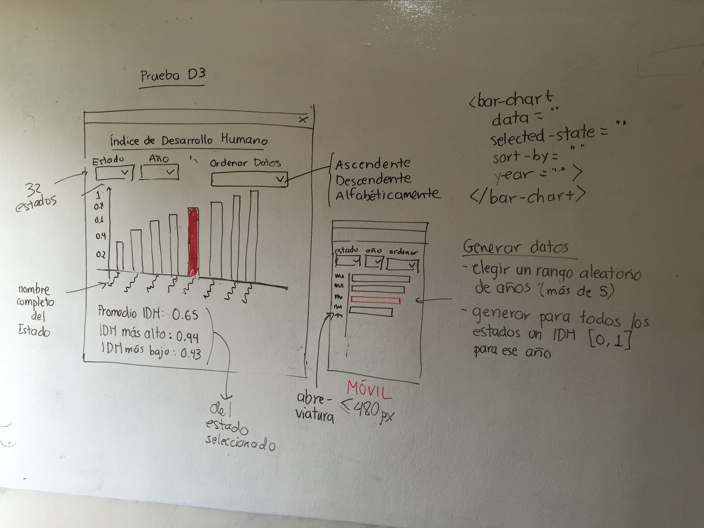

# DATA4 Front-end Data-Viz Developer 
## *Departamento de Data-Driven Web Platforms*

[DATA4](http://data4.mx/) convierte datos en información accionable por medio de plataformas de recolección, procesamiento, análisis y visualización de información.

El departamento de tecnología está encargado de elaborar plataformas y visualizaciones usando principalmente HTML5, CSS3, JQuery, Angular, D3js. 

### Requerimientos
* Experiencia usando GIT
* Experiencia en Web Development: HTML5, CSS3 (Material Design, Bootstrap, Foundation)
* Javascript libraries (JQuery, D3js)
* Javascript frameworks (Angular, Vue, React)
* Desarrollo ágil y actualizaciones constantes
* Inglés

### Responsabilidades
* Planear, estimar, desarrollar y realizar actualizaciones constantes (GIT) a las plataformas en curso.
* Entregar código probado, funcional, comentado y fácil de interpretar.
* Participar en revisiones internas de código.
* Brindar soporte en las operaciones de las plataformas y responder a problemas de rendimiento. 

Estas herramientas son utilizadas para realizar sistemas de gestión y visualización de datos trabajando desde la arquitectura de los datos hasta la construcción de excelentes UI y UX de las plataformas. En el equipo de trabajo creemos firmemente en la colaboración y el aprendizaje continuo con mucha apertura a la experimentación y el auto aprendizaje. Si te interesa lo que realizamos en DATA4 y quieres formar parte del equipo de trabajo, te invitamos a realizar la siguiente prueba para ser candidato a una entrevista personal. 

# Prueba D3 - Índice de Desarrollo Humano

Desplegar una gráfica de barras en la que se muestran los valores del Índice de Desarrollo Humano de las 32 entidades de México.

En la parte superior se ubican 3 dropdowns que permiten:

1. Seleccionar un estado
2. Seleccionar un año
3. Ordenar los datos (alfabéticamente (A - Z) | ascendente (0 - 1) | descendente (1 - 0))

## Datos

Generar aleatoriamente los datos para las gráficas en cuanto se carga la página

1. Elegir un rango aleatorio de años (más de 5)
2. Cada año deberá tener datos para las 32 entidades
3. Dar a cada entidad y año un valor aleatorio al IDH entre 0 y 1 (usar decimales)

## Gráfica

Encapsular la lógica para dibujar la gráfica en un componente de Angular que haga uso de los siguientes atributos:

1. data: un Arreglo de objetos con los datos con los que se pintará la gráfica
2. selectedYear: año que se quiere visualizar
3. selectedState: Estado seleccionado -> destacar la barra de este estado con un color distinto
4. sort: forma de ordenar los datos

## UX

Cuando el ancho de la pantalla sea mayor a 480px, las barras deben ser verticales y los rótulos deben mostrar el nombre completo del estado; mientras que cuando sea menor o igual a 480px, las barras deben ser horizontales y los rótulos deben mostrar la abreviatura del estado.

Hacer la interfaz responsiva utilizando Materialize o Bootstrap.

La gráfica debe redibujarse cuando cambie el estado seleccionado, el año o la forma de ordenamiento, sin necesidad de botones adicionales.

## Plus

1. Seguir la guía de estilo de Angular (John Papa) [https://angular.io/guide/styleguide](https://angular.io/guide/styleguide) 
2. Instalar dependencias usando npm
3. Comentar y explicar el código.

## Entrega

Compartir el repositorio de Git en el que esté el código y si es posible, subir el proyecto usando un PaaS como Heroku u OpenShift.

## Mockup

